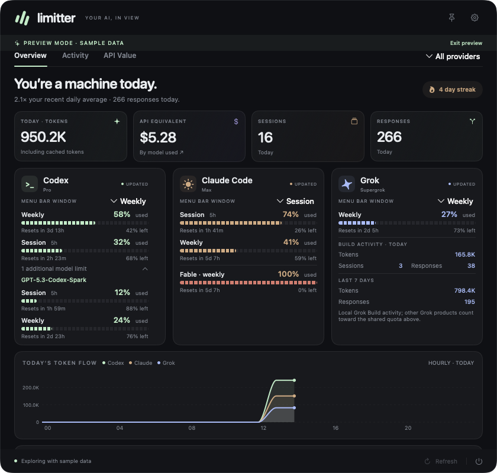
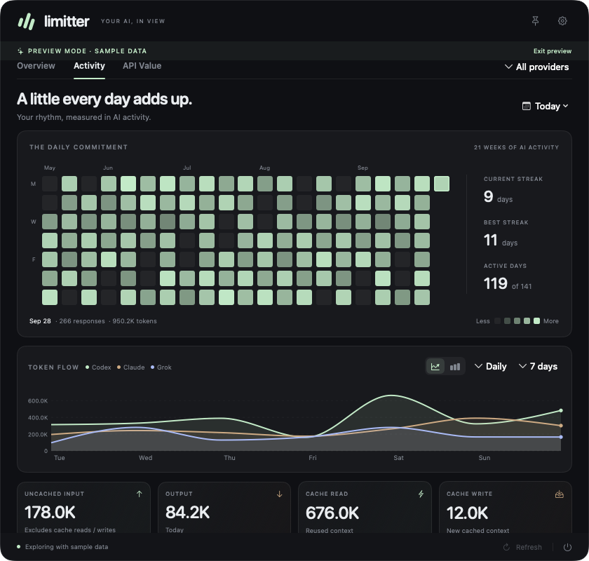

# Limitter

A native macOS menu bar app for monitoring Codex, Claude Code, and Grok usage.
See subscription limits, reset times, and local token activity in one dashboard.
Built with SwiftUI, AppKit, and Swift Charts, with no third-party package dependencies.



*Sample data. Available quota windows depend on your provider and account.*

## Features

- **Menu bar usage:** choose providers, session or weekly limits, used or remaining percentages, and token totals.
- **Provider dashboard:** quota meters, reset countdowns, and model-specific limits when reported by the provider.
- **Local activity:** token lines or stacked histograms with adjustable time buckets, recent sessions, and per-model usage across available local logs.
- **Daily commitment:** a 21-week activity grid fills the card with fixed-size square tiles, alongside current streak, best streak, and active-day counts. Hover or select a day to inspect responses and tokens.
- **Daily notes:** optional playful messages reflect today’s activity, quota state, and streak; a factual mode is also available.
- **API cost estimates:** estimate the USD API equivalent of recorded tokens, with a model breakdown you can sort by tokens or API value, and an optional custom benchmark. Newly used models trigger a pricing refresh automatically; missing rates retry every 15 minutes until published.
- **Native controls:** dark, light, or system appearance; a pinnable dashboard; and launch at login.
- **Explicit data states:** unavailable and expired readings stay visible as such; stale Claude fallback readings are marked as last known.

Account limits and local token totals measure different things: limits come from
provider accounts, while activity comes from logs on this Mac. API estimates are
hypothetical token costs, not subscription charges or invoices.



*Sample data. The final week includes only dates through today.*

## Download

[Download Limitter for macOS](https://github.com/admnov38/limitter/releases/latest/download/Limitter-macOS-universal.zip)

Requires macOS 14 or later; the same app supports Apple Silicon and Intel Macs.
Unzip the download and move **Limitter.app** to **Applications**. Quit an older
copy before opening the new version. Version details and SHA-256 checksums are
available on the [releases page](https://github.com/admnov38/limitter/releases/latest).

The app is ad-hoc signed, not Apple Developer ID-signed or notarized. macOS may
block the first launch. If you trust this download, use **System Settings →
Privacy & Security → Open Anyway** after attempting to open it.

## Build and run

Requires **macOS 14 or later** and a **Swift 5.10 or newer toolchain** with the macOS
SDK (Xcode or compatible Xcode Command Line Tools). Python 3 is needed only for
the connector integration checks.

From the repository root:

```sh
./scripts/build.sh
open dist/Limitter.app
```

The script builds a release executable, generates the app icon, and creates an
ad-hoc-signed `dist/Limitter.app` for your Mac's architecture. You can move the app
to `/Applications`. Quit an older running copy before launching a rebuilt version.
This source build is not Developer ID-signed or notarized.

Settings open on first launch. Closing that window leaves Limitter in the menu
bar. Hover or click the readout to open the dashboard; pin it to keep it visible.
Right-click the readout to reopen Settings.

To explore without connecting an account, quit any running copy and launch sample mode:

```sh
open dist/Limitter.app --args --demo --show
```

## Connect your providers

Install and sign in to the provider tools you use. You do not need all three.
Open **Settings → Connections** in Limitter to inspect connection status.

| Provider | Requirements | Data source |
| --- | --- | --- |
| Codex | A signed-in Codex CLI, or the executable bundled with Codex/ChatGPT | Read-only app-server account requests and local Codex session logs |
| Claude Code | A signed-in Claude Code CLI with structured usage support | Read-only account usage requests and local Claude project logs |
| Grok | Grok Build, signed in with `grok login` | Read-only billing requests and local Build session logs |

Provider interfaces can change. An installed CLI does not guarantee that your
account exposes every quota window or model allowance. Connection errors appear
in the app instead of being replaced with sample values.

For Claude, **Connect Claude limits** installs an optional status-line fallback.
It backs up Claude settings, wraps the existing status-line command, and preserves
its output. Disconnect restores the previous status line. This fallback supplies
session and overall weekly readings when available; separate model caps require
the account connection.

## Reading the menu bar

`CX`, `CL`, and `GK` identify Codex, Claude, and Grok. `S` means session and `W`
means weekly. Rings indicate quota consumed; the accompanying numbers follow
your display preference.

| Readout | Meaning |
| --- | --- |
| `CX W 73%` | Codex weekly reading; percentage meaning follows the used/remaining setting |
| `CL W ~83%` | An older, unexpired Claude fallback reading |
| `—` | The selected reading is unavailable, expired, or unreadable |

Press **⌘R** to refresh, **⌘,** for Settings, **Escape** to close the dashboard,
and **⌘Q** to quit while Limitter has focus. Use `--background` to launch without
the settings window, or `--show` to open the dashboard immediately.

## Privacy and limitations

Limitter reads local usage logs and asks installed provider tools for account
limits. Provider tools handle authentication; Limitter does not read their
credential stores or send model prompts. Limitter has no telemetry.

It also downloads public pricing data from Anthropic and LiteLLM, caches it
locally, and uses built-in rates when no downloaded rate is available. Usage logs
are not uploaded by Limitter. Provider tools still communicate with their own
services when fulfilling account requests.

Local history excludes activity that is absent from this Mac's logs. Session
state is inferred from transcript events, and pricing excludes some fees and
premiums. Unknown models remain unpriced instead of silently receiving another
model's rates. See [Data, connections, and privacy](docs/data-and-privacy.md) for
storage locations, refresh behavior, accounting rules, and pricing limitations.

## Development

```sh
swift test -c release
./scripts/build.sh
python3 scripts/test-connector.py dist/Limitter.app/Contents/MacOS/Limitter
```

Open `Package.swift` in Xcode to work on the app. See the
[development guide](docs/development.md) for diagnostics, UI verification,
screenshot generation, and release checks.

## Project status

The current source release is **1.4.4**. Limitter is an independent project and is
not affiliated with OpenAI, Anthropic, or xAI. Provider compatibility depends on
the installed CLI version and the account data it exposes.
